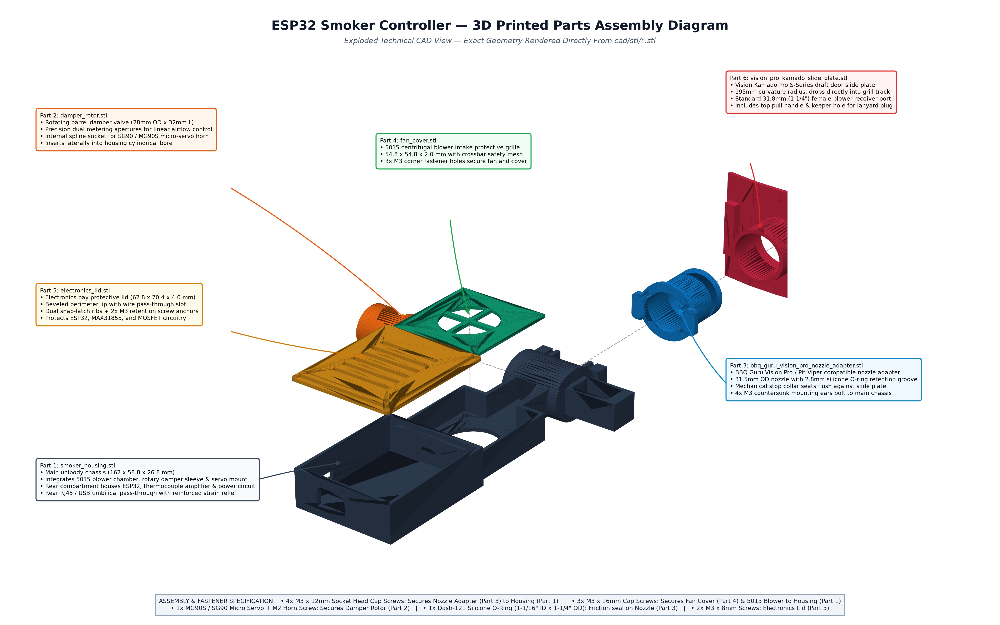

# Parametric Fan & Servo Damper CAD

This directory contains the 3D-printable mechanical CAD design for the ESP32 Smoker Controller, implemented in OpenSCAD.

> **Assembly Guide**: For full step-by-step mechanical fastener assembly, see [docs/assembly-guide.md](../docs/assembly-guide.md).



---

## Design Highlights

1. **Parametric Output Adapter**:
   - **BBQ Guru Vision Pro / Pit Viper Preset** (`output_preset = "bbq_guru"`):
     - Sized specifically to fit into the BBQ Guru metal Vision Pro S-Series adapter sleeve (`https://www.bbqguru.com/product/vision-pro-adapter-s-series/`).
     - Outer diameter: **31.5mm** (standard 1-1/4" nominal with 0.25mm slip-fit clearance).
     - Insertion length: **32.0mm** with 1.5mm lead-in chamfer.
     - Integrated O-ring retention groove (2.8mm wide, 1.4mm deep, located 10mm from tip) for airtight friction sealing with standard Dash-121 / Dash-122 silicone O-rings.
     - Integrated 38mm mechanical stop collar to prevent over-insertion against the adapter face.
   - **Vision Pro S-Series Curved Slide Door Replacement** (`part = "vision_pro_plate"`):
     - Complete 3D-printable curved slide door that drops directly into the Vision Kamado Pro S-Series bottom vent track (width: 82mm, height: 74mm, radius: 195mm).
     - Features a female 31.8mm BBQ Guru receiver port and pull handle tab.
   - **Round Pipe**: Configurable outer diameter (e.g., 25.4mm for 1" NPT, 31.75mm for 1.25", or 38.1mm for 1.5").
   - **Rectangular Duct**: Configurable width and height to match Kamado bottom slide vents (Big Green Egg, Kamado Joe) or Weber Smokey Mountain (WSM) draft dampers.
   - **Mounting Flange**: Optional bolt-on flange with configurable screw spacing.
   - **Modular Attachment**: The output nozzle attaches via 4x M3 screws, allowing you to swap smoker adapters without reprinting the main housing.

2. **Parametric Fan Sizing**:
   - `fan_size` & `fan_depth` accommodate standard radial blower sizes:
     - **5015** (`fan_size = 50`, `fan_depth = 15`): Ultra-compact for small/medium cookers (WSM 18.5", Kamado Classic).
     - **7530** (`fan_size = 75`, `fan_depth = 30`): High-output for drum smokers and larger pits.
     - **9733** (`fan_size = 97`, `fan_depth = 33`): Heavy-duty commercial/offset airflow.

3. **Two System Packaging Configurations**:
   - **Configuration A: All-in-One Integrated Pod (`include_electronics_bay = true`)**:
     - Contains an attached electronics bay housing the ESP32 development board, 5V USB-C power breakout, MOSFET blower switch, and MAX31855 thermocouple amplifier.
     - Direct USB-C power connection for phone chargers and USB battery bricks.
   - **Configuration B: Slim Tethered Pod (`include_electronics_bay = false`)**:
     - Eliminates the electronics bay in favor of an RJ45 modular jack recess.
     - Connects via standard Cat5/Cat6 umbilical cable to a remote controller base unit.

4. **Servo-Driven Damper Valve**:
   - Houses a TowerPro MG90S metal-gear (or SG90) micro-servo.
   - The cylindrical barrel rotor features a cross-bore aperture that aligns with the fan exhaust at 90° rotation and hermetically blocks the airway at 0° to prevent the chimney draft effect.

---

## Printable Parts in `smoker_damper.scad`

Select which component to render via the `part` variable or from the command line:

```bash
# 1. Main Housing Body (holds fan, damper, and servo)
openscad -o housing.stl -D 'part="housing"' smoker_damper.scad

# 2. Damper Rotor (rotating valve cylinder)
openscad -o rotor.stl -D 'part="rotor"' smoker_damper.scad

# 3. Output Adapter - BBQ Guru Vision Pro / Pit Viper Nozzle (1.25" / 31.5mm OD with O-ring groove)
openscad -o adapter_bbq_guru.stl -D 'part="output_adapter"; output_preset="bbq_guru"' smoker_damper.scad

# 4. Vision Pro S-Series Curved Slide Door Replacement Plate (drops into Kamado track)
openscad -o vision_pro_plate.stl -D 'part="vision_pro_plate"' smoker_damper.scad

# 5. Output Adapter - Round Pipe (1" NPT)
openscad -o adapter_round.stl -D 'part="output_adapter"; output_preset="npt_1"' smoker_damper.scad

# 6. Output Adapter - Rectangular (50mm x 30mm)
openscad -o adapter_rect.stl -D 'part="output_adapter"; output_preset="kamado_rect"' smoker_damper.scad

# 7. Electronics Bay Lid (for Config A)
openscad -o lid.stl -D 'part="lid"' smoker_damper.scad

# 8. Fan Intake Protective Grille
openscad -o fan_cover.stl -D 'part="fan_cover"' smoker_damper.scad
```

Pre-compiled binary STL files ready for slicing are also available in `cad/stl/`.

---

## Assembly Diagram Generation

The technical exploded assembly diagram (`parts_assembly_diagram.jpg`) is generated directly from the 3D meshes in `cad/stl/`:

```bash
uv run --with numpy-stl --with matplotlib --with pillow python cad/render_assembly_diagram.py
```

---

## 3D Printing Recommendations

* **Material**: **PETG**, **ABS**, or **ASA** are strongly recommended. PLA is **not** recommended due to radiant heat near smoker firebox vents ($>60^\circ\text{C}$).
* **Layer Height**: $0.20\,\text{mm}$ (or $0.16\,\text{mm}$ for the rotor to ensure smooth surface finish).
* **Infill**: $25\%\text{--}40\%$ gyroid or grid for structural rigidity.
* **Perimeters/Walls**: 4 perimeters for heat resistance and air-tightness.
* **Rotor Fit**: The default clearance is $0.45\,\text{mm}$. If the rotor fits too tightly in the housing, adjust `rotor_clearance = 0.55` before slicing. A small touch of food-safe silicone lubricant or graphite can be applied to the barrel for zero-friction movement.
* **BBQ Guru O-Ring**: Use a standard Dash-121 (1-1/16" ID x 1-1/4" OD x 3/32" C/S) or Dash-122 (1-1/8" ID) high-temperature red silicone O-ring in the nozzle groove.
