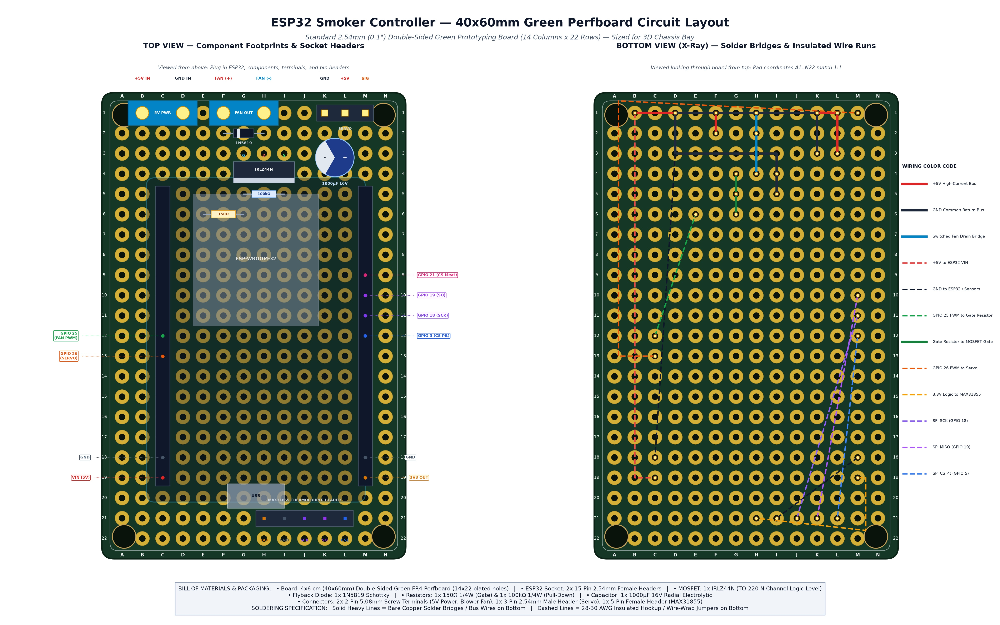
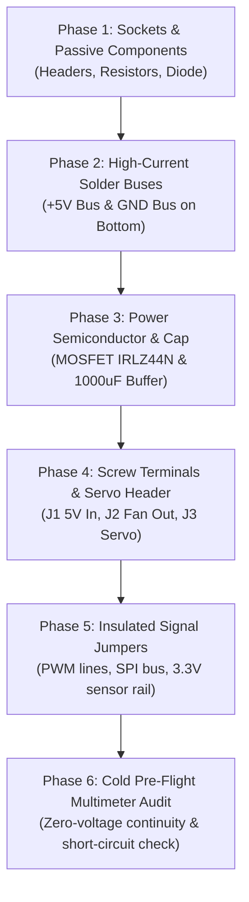

# Hobbyist Green Perfboard Circuit Board Layout & Assembly Guide

> Step-by-step assembly manual, coordinate grid schedule, and solder trace layout for building the ESP32 Smoker Controller on a standard $40\,\text{mm} \times 60\,\text{mm}$ ($4 \times 6\,\text{cm}$) double-sided green prototyping board (perfboard).

---

## 1. Visual Circuit Board Layout Diagram

The technical diagram below illustrates both the **Top View** (component placement, sockets, and terminals) and the **Bottom View (X-Ray)** (solder bridges, copper bus wire, and insulated jumper routes):

---

## 2. Overview & Design Rationale

* **Direct Chassis Fit**: Standard double-sided green FR4 prototype boards ($40\,\text{mm} \times 60\,\text{mm}$, with 14 columns $\times$ 22 rows of $2.54\,\text{mm}$ / $0.1''$ pitch plated through-holes) drop directly into the rear electronics bay of the 3D-printed housing ([`cad/smoker_damper.scad`](../cad/smoker_damper.scad)).
* **Socketed ESP32**: The ESP32 DevKit is mounted using two 15-pin female socket headers rather than being soldered permanently, allowing easy removal for bench testing or firmware re-flashing.
* **Separation of Power & Sensors**:
  * **Top Section (Rows 1–6)**: Houses all high-current 5V power routing (USB power terminal, blower fan screw terminal, MOSFET low-side switch, flyback diode, servo header, and 1000µF brownout buffer capacitor).
  * **Middle Section (Rows 5–19)**: ESP32 DevKit socket headers with low-profile gate resistors tucked underneath.
  * **Bottom Section (Rows 20–22)**: 3.3V logic and SPI bus headers for the MAX31855 thermocouple amplifier module, facing the end-wall thermocouple port.

---

## 3. Bill of Materials (BOM)

| Reference | Component | Package / Footprint | Rating / Specification | Notes |
| :--- | :--- | :--- | :--- | :--- |
| **PCB** | Prototyping Perfboard | $40\,\text{mm} \times 60\,\text{mm}$ ($4\times 6\,\text{cm}$) | Double-sided FR4, $2.54\,\text{mm}$ ($0.1''$) pitch, 14 cols $\times$ 22 rows | Ubiquitous green board (Elegoo, Smraza, generic Amazon/AliExpress) |
| **U1 Sockets** | ESP32 DevKit Sockets | 2x 15-pin Female Headers | $2.54\,\text{mm}$ pitch, single row ($8.5\,\text{mm}$ plastic height) | Accepts 30-pin ESP32 DevKit v1 |
| **Q1** | N-Channel MOSFET | TO-220 Through-Hole | **IRLZ44N** or **FQP30N06L** ($V_{\text{GS(th)}} \le 2.0\,\text{V}$, Logic-Level) | Controls 5015 blower fan ground path |
| **D1** | Flyback Snubber Diode | DO-41 Axial Through-Hole | **1N5819** Schottky ($40\,\text{V}, 1\,\text{A}$) | Clamps inductive motor voltage spikes |
| **C1** | Buffer Capacitor | Radial Can Through-Hole | **$1000\,\mu\text{F}$ 16V** Electrolytic ($8\text{--}10\,\text{mm}$ dia, $5\,\text{mm}$ pitch) | Absorbs servo inrush currents; prevents ESP32 brownouts |
| **R1** | Gate Resistor | Axial 1/4W Resistor | **$150\,\Omega$** (Brown-Green-Brown-Gold) | Limits ESP32 GPIO 25 gate charging surge current |
| **R2** | Gate Pull-Down Resistor| Axial 1/4W Resistor | **$100\,\text{k}\Omega$** (Brown-Black-Yellow-Gold) | Holds Gate low during boot so fan stays OFF |
| **J1** | 5V Power Input | 2-Pin Screw Terminal Block | $5.08\,\text{mm}$ pitch (blue or green block) | Pin 1 = `+5V`, Pin 2 = `GND` |
| **J2** | Blower Fan Output | 2-Pin Screw Terminal Block | $5.08\,\text{mm}$ pitch (blue or green block) | Pin 1 = `+5V FAN`, Pin 2 = `Switched DRAIN` |
| **J3** | Servo Damper Header | 3-Pin Male Header | $2.54\,\text{mm}$ pitch, straight pins | Pin 1 = `GND`, Pin 2 = `+5V`, Pin 3 = `SIG` |
| **J4** | Thermocouple Header | 5-Pin Female Header | $2.54\,\text{mm}$ pitch, straight socket | Accepts MAX31855 breakout board (3V3, GND, SCK, SO, CS) |
| **W1–W8** | Hookup Wire | 28–30 AWG Insulated | Flexible silicone or Kynar wire-wrap | Bottom-side signal runs |

---

## 4. Grid Coordinate Pinout Schedule

Coordinates follow standard battleship grid notation: **Columns A through N** ($X = 1 \dots 14$) from left to right, and **Rows 1 through 22** ($Y = 1 \dots 22$) from top to bottom.

### 4.1 Component Placement (Top Side)

| Component | Lead / Pin | Grid Hole (Col, Row) | Net / Connection |
| :--- | :--- | :---: | :--- |
| **J1 (5V Power Terminal)** | Pin 1 (`+5V IN`) | **(B, 1)** | Connects to +5V high-current bus |
| | Pin 2 (`GND IN`) | **(D, 1)** | Connects to common ground bus |
| **J2 (Fan Output Terminal)**| Pin 1 (`+5V FAN`) | **(F, 1)** | Connects to +5V high-current bus & D1 Cathode |
| | Pin 2 (`DRAIN (-)`) | **(H, 1)** | Connects to Q1 Drain & D1 Anode |
| **J3 (Servo Header)** | Pin 1 (`GND`) | **(K, 1)** | Connects to common ground bus & C1 (-) lead |
| | Pin 2 (`+5V`) | **(L, 1)** | Connects to +5V high-current bus & C1 (+) lead |
| | Pin 3 (`SIG`) | **(M, 1)** | Connects to ESP32 GPIO 26 |
| **D1 (1N5819 Diode)** | Cathode (silver bar) | **(F, 2)** | Solder-bridged to (F, 1) (`+5V`) |
| | Anode | **(H, 2)** | Solder-bridged to (H, 1) (`DRAIN`) |
| **C1 (1000µF Capacitor)** | Negative Lead `(-)` | **(K, 3)** | Solder-bridged to (K, 1) (`GND`) |
| | Positive Lead `(+)` | **(L, 3)** | Solder-bridged to (L, 1) (`+5V`) |
| **Q1 (IRLZ44N MOSFET)** | Pin 1: Gate (G) | **(G, 4)** | Connects to R1 ($150\,\Omega$) & R2 ($100\,\text{k}\Omega$) |
| | Pin 2: Drain (D) | **(H, 4)** | Solder-bridged to (H, 2) and (H, 1) |
| | Pin 3: Source (S) | **(I, 4)** | Solder-bridged to common ground bus |
| **R2 (100kΩ Resistor)** | Lead 1 | **(G, 5)** | Solder-bridged to (G, 4) (Gate) |
| | Lead 2 | **(I, 5)** | Solder-bridged to (I, 4) (Source / GND) |
| **R1 (150Ω Resistor)** | Lead 1 (Input) | **(E, 6)** | Connects to ESP32 GPIO 25 via jumper wire |
| | Lead 2 (Output) | **(G, 6)** | Solder-bridged to (G, 5) and (G, 4) (Gate) |
| **U1-Left (ESP32 Socket)** | Pins 1–15 | **(C, 5) to (C, 19)** | Left socket header (accepts pins EN through VIN) |
| **U1-Right (ESP32 Socket)**| Pins 16–30 | **(M, 5) to (M, 19)**| Right socket header (accepts pins 3V3 through D23) |
| **J4 (MAX31855 Header)** | Pin 1 (`3V3`) | **(H, 21)** | Connects to ESP32 3V3 output at (M, 19) |
| | Pin 2 (`GND`) | **(I, 21)** | Connects to common ground bus |
| | Pin 3 (`SCK`) | **(J, 21)** | Connects to ESP32 GPIO 18 at (M, 11) |
| | Pin 4 (`SO / MISO`) | **(K, 21)** | Connects to ESP32 GPIO 19 at (M, 10) |
| | Pin 5 (`CS Pit`) | **(L, 21)** | Connects to ESP32 GPIO 5 at (M, 12) |

---

## 5. Step-by-Step Soldering Sequence

Follow this assembly order to ensure easy mechanical access and avoid trapping wires under larger parts:

### Phase 1: Low-Profile Components & Sockets
1. Insert the two 15-pin female socket headers at **(C, 5..19)** and **(M, 5..19)**. Secure with tape, flip the board, and solder corner pins first to align flush.
2. Insert the $150\,\Omega$ gate resistor across **(E, 6)** and **(G, 6)**. Solder on bottom and trim excess leads.
3. Insert the $100\,\text{k}\Omega$ pull-down resistor across **(G, 5)** and **(I, 5)**. Solder on bottom and trim.
4. Insert the 1N5819 Schottky diode across **(F, 2)** and **(H, 2)** with the **silver cathode band facing (F, 2)**.

### Phase 2: High-Current Solder Buses & Bridges
Use bent component leads or bare 20–22 AWG solid tinned copper wire:
1. **+5V Main Rail**: Run a solid wire from **(B, 1)** $\rightarrow$ **(F, 1)** $\rightarrow$ **(L, 1)**.
   * Solder-bridge **(F, 1)** to diode cathode at **(F, 2)**.
   * Solder-bridge **(L, 1)** to capacitor positive pad at **(L, 3)**.
2. **Ground Main Rail**: Run a solid wire from **(D, 1)** $\rightarrow$ **(D, 3)** $\rightarrow$ **(I, 3)** $\rightarrow$ **(I, 4)** $\rightarrow$ **(I, 5)**.
   * Bridge to servo ground at **(K, 1)** $\rightarrow$ **(K, 3)**.
3. **Switched Fan Drain Bridge**: Create a continuous 3-pad solder bridge from **(H, 1)** (Fan -) down through **(H, 2)** (Diode Anode) to **(H, 4)** (MOSFET Drain).
4. **Gate Node Bridge**: Create a continuous 3-pad solder bridge from **(G, 6)** ($150\,\Omega$ out) through **(G, 5)** ($100\,\text{k}\Omega$) to **(G, 4)** (MOSFET Gate).

### Phase 3: Power Semiconductor & Buffer Capacitor
1. **MOSFET (Q1)**: Insert the IRLZ44N into **(G, 4)** [Gate], **(H, 4)** [Drain], and **(I, 4)** [Source]. The metal tab should face toward Row 5. Solder in place.
2. **Capacitor (C1)**: Insert the $1000\,\mu\text{F}$ capacitor into **(K, 3)** [Negative Lead `(-)`] and **(L, 3)** [Positive Lead `(+)`]. Observe the white/grey stripe on the body indicating the negative lead! Solder and trim.

### Phase 4: External Connectors
1. Insert the 5V Power screw terminal at **(B, 1)** and **(D, 1)** (wire entry facing top edge).
2. Insert the Blower Fan screw terminal at **(F, 1)** and **(H, 1)**.
3. Insert the 3-pin male servo header at **(K, 1)**, **(L, 1)**, and **(M, 1)**.
4. Insert the 5-pin female MAX31855 header at **(H, 21)** through **(L, 21)**.

### Phase 5: Point-to-Point Insulated Signal Jumpers
Run thin insulated wire (28–30 AWG Kynar or silicone hookup wire) on the bottom layer:
1. **+5V to ESP32**: Jumper from **(B, 1)** to ESP32 `VIN` at **(C, 19)**.
2. **GND to ESP32**: Jumper from **(D, 3)** to ESP32 `GND` at **(C, 18)**.
3. **Fan PWM**: Jumper from ESP32 `GPIO 25` at **(C, 12)** to $150\,\Omega$ input at **(E, 6)**.
4. **Servo PWM**: Jumper from ESP32 `GPIO 26` at **(C, 13)** along outer border up to Servo Signal at **(M, 1)**.
5. **3.3V Sensor Power**: Jumper from ESP32 `3V3` at **(M, 19)** to MAX31855 `VCC` at **(H, 21)**.
6. **Sensor Ground**: Jumper from ESP32 `GND` at **(M, 18)** to MAX31855 `GND` at **(I, 21)**.
7. **SPI SCK**: Jumper from ESP32 `GPIO 18` at **(M, 11)** to MAX31855 `SCK` at **(J, 21)**.
8. **SPI SO (MISO)**: Jumper from ESP32 `GPIO 19` at **(M, 10)** to MAX31855 `SO` at **(K, 21)**.
9. **SPI CS Pit**: Jumper from ESP32 `GPIO 5` at **(M, 12)** to MAX31855 `CS` at **(L, 21)**.

### Phase 5.1: Optional Inland E-Ink Screen Harness (Lid-Mounted)
If installing an Inland 2.13" or 1.54" e-Paper display in the electronics lid, run an 8-wire ribbon cable or DuPont harness from the following ESP32 socket pins:

| E-Ink Header Pin | ESP32 Board Pin | Grid Coord | Function |
| :--- | :--- | :---: | :--- |
| **1. VCC** | `3V3` | **(M, 19)** | 3.3V Logic Supply |
| **2. GND** | `GND` | **(M, 18)** | Common Ground |
| **3. DIN / MOSI**| `GPIO 23` | **(M, 5)** | Master-Out-Slave-In |
| **4. CLK / SCK** | `GPIO 18` | **(M, 11)** | SPI Clock (shared with MAX31855) |
| **5. CS** | `GPIO 4` | **(C, 16)** | E-Ink Chip Select |
| **6. DC** | `GPIO 22` | **(M, 6)** | Data / Command Select |
| **7. RST** | `GPIO 16` | **(C, 14)** | Hardware Reset |
| **8. BUSY** | `GPIO 17` | **(C, 15)** | Busy Status |

---

## 6. Pre-Flight Multimeter Inspection (Do NOT plug in ESP32 yet!)

Perform these electrical safety checks with a Digital Multimeter (DMM) set to **Continuity / Resistance Mode** before applying power:

| Check # | Test Points | Expected Reading | Fault Condition & Cause |
| :---: | :--- | :---: | :--- |
| **1** | Power Terminal `+5V` (B1) to `GND` (D1) | **Open Circuit / High Resistance** ($> 10\,\text{k}\Omega$) | If $< 100\,\Omega$ or beeping: **DEAD SHORT** on 5V bus! Check capacitor polarity and solder blobs. |
| **2** | ESP32 Socket `VIN` (C19) to Power `+5V` (B1) | **$0.0\,\Omega$ (Direct Continuity)** | If open: Check Phase 5 Jumper #1. |
| **3** | ESP32 Socket `GND` (C18 & M18) to Power `GND` (D1) | **$0.0\,\Omega$ (Direct Continuity)** | If open: Check Phase 5 Jumper #2. |
| **4** | Fan Output `+5V` (F1) to Power `+5V` (B1) | **$0.0\,\Omega$ (Direct Continuity)** | If open: Check top rail copper bus. |
| **5** | MOSFET Drain (H4) to Fan Output `DRAIN` (H1) | **$0.0\,\Omega$ (Direct Continuity)** | If open: Check 3-pad solder bridge. |
| **6** | MOSFET Gate (G4) to Ground (I4) | **$100.0\,\text{k}\Omega \pm 5\%$** | Verifies pull-down resistor integrity. |
| **7** | ESP32 `GPIO 25` (C12) to MOSFET Gate (G4) | **$150.0\,\Omega \pm 5\%$** | Verifies gate protection resistor connection. |
| **8** | ESP32 `GPIO 26` (C13) to Servo Signal (M1) | **$0.0\,\Omega$ (Direct Continuity)** | If open: Check servo PWM jumper. |
| **9** | ESP32 `3V3` (M19) to MAX31855 `VCC` (H21) | **$0.0\,\Omega$ (Direct Continuity)** | Verifies sensor power rail. |
| **10** | D1 Diode Test Mode (F2 to H2) | **$0.25\text{--}0.45\,\text{V}$ forward drop** (Cathode at F2) | If $0.0\,\text{V}$: Diode shorted; if inverted: Diode backwards! |

---

## 7. Power-Up & Bench Testing Procedure

1. **Step 1: First Power-On (Without ESP32)**
   * Connect a 5V USB-C or bench power supply to the 5V Power Terminal `(B1, D1)`.
   * Measure voltage with DMM across socket pins:
     * Pin `(C19)` (`VIN`) to `(C18)` (`GND`): Must read **$4.9\text{--}5.2\,\text{V}$ DC**.
     * Fan terminal `(F1)` to `(D1)`: Must read **$5.0\,\text{V}$ DC**.
     * Fan terminal `(H1)` (Drain): Must float high or show no return to ground.
2. **Step 2: Insert ESP32**
   * Disconnect power.
   * Firmly seat the ESP32 DevKit into socket headers `(C5..19)` and `(M5..19)` with the micro-USB port oriented toward Row 20 (bottom).
   * Reconnect 5V power. Verify the red power LED on the ESP32 illuminates.
3. **Step 3: Connect Blower Fan & Servo**
   * Wire the 5015 blower fan red lead to `(F1)` and black lead to `(H1)`.
   * Plug the MG90S servo into header `(K1..M1)` with the brown ground wire to `K1`.
   * Power on the controller. The fan should remain **completely silent and stopped** during boot.
   * Through the Web UI or serial console, send a command to set fan speed to 50%:
     * Blower fan should spin up smoothly at 25 kHz PWM.
     * Set servo angle to $90^\circ$: Servo should rotate cleanly without causing brownouts or rebooting the ESP32.
4. **Step 4: Thermocouple Verification**
   * Plug the MAX31855 breakout module into header `(H21..L21)`.
   * Connect K-Type thermocouple probe to the screw terminal.
   * The web interface should immediately report ambient room temperature (e.g. $72^\circ\text{F} / 22^\circ\text{C}$).
   * Warm the probe tip with your fingers to observe responsive temperature rise.

---

## 8. Installation into 3D Enclosure (`cad/smoker_damper.scad`)

1. Slide the assembled green perfboard into the rear bay of [`smoker_housing.stl`](../cad/stl/smoker_housing.stl).
2. The top edge (Row 1) faces the divider wall: fan and servo wires pass cleanly through the divider cutout.
3. The bottom edge (Row 22) faces the rear wall: thermocouple probe wires exit directly through the end-wall slot.
4. Align [`electronics_lid.stl`](../cad/stl/electronics_lid.stl) over the bay and secure with two M3x6mm screws.
