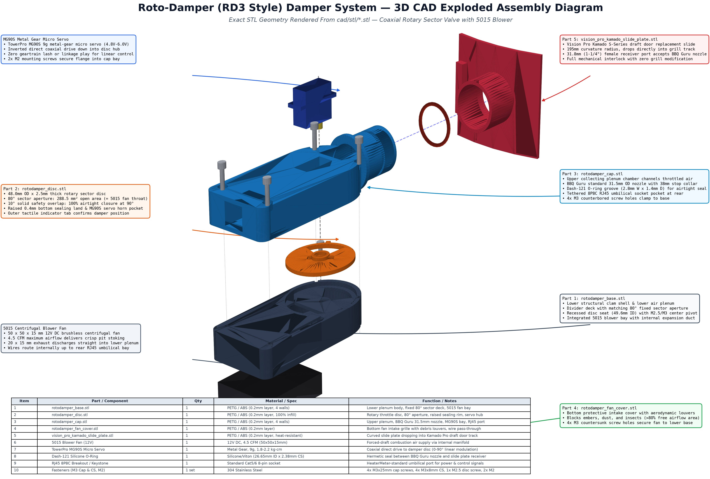

# Roto-Damper (RD3 Style) Damper System — Technical Guide

This guide details **Design 2: Roto-Damper (RD3 Style)**, a compact 4-piece rotary sector valve blower system inspired by the HeaterMeter RD3 community architecture. It includes full mechanical specifications, 3D printing parameters, exploded assembly instructions, electrical umbilical pinouts, and a side-by-side comparison with **Design 1: Integrated Barrel Damper Pod**.

---

## 1. System Overview & Architecture



The **Roto-Damper** design decouples the blower/damper hardware at the smoker draft vent from the main microcontroller electronics. Instead of an onboard microcontroller bay, it uses a **tethered RJ45 umbilical interface** (standard Cat5/Cat6 8P8C) connecting back to the external ESP32 controller / [Green Perfboard Circuit Layout](perfboard-assembly-guide.md).

### Core Architectural Features

1. **Direct Coaxial Servo Drive**:
   - The TowerPro MG90S metal-gear micro-servo is mounted inverted directly above the central axis of the damper disc.
   - Its output spline engages the disc hub pocket with zero linkages, gears, or bellcranks, eliminating all mechanical backlash.
2. **80-Degree Sector Aperture Valve**:
   - An $80^\circ$ radial sector opening ($r_{in} = 7.0\,\text{mm}$, $r_{out} = 21.5\,\text{mm}$) provides an unobstructed flow area of **$288.5\,\text{mm}^2$**, matching the $20 \times 15\,\text{mm} = 300\,\text{mm}^2$ exhaust throat of a 5015 centrifugal blower fan (96.2% parity).
   - At $90^\circ$ closed rotation, the solid plate covers the fixed base port with a **$10^\circ$ solid safety overlap margin**, creating a 100% hermetic seal against natural chimney drafting.
3. **Plenum Equalization Chamber**:
   - The fan exhaust discharges into a lower circular plenum chamber ($43.6\,\text{mm}$ ID $\times 13.0\,\text{mm}$ H) where dynamic air pressure converts to uniform static pressure before passing upward through the sector valve into the upper collecting plenum.
4. **BBQ Guru Standard Output Nozzle**:
   - An integral $31.5\,\text{mm}$ OD output nozzle ($26.5\,\text{mm}$ ID, $32.0\,\text{mm}$ insertion length) with a Dash-121 silicone O-ring groove and $38.0\,\text{mm}$ mechanical stop collar slides directly into [`vision_pro_kamado_slide_plate.stl`](../cad/stl/vision_pro_kamado_slide_plate.stl).
5. **Ergonomic Clam-Shell Puck**:
   - Compact footprint ($56\,\text{mm}$ width $\times 104\,\text{mm}$ length $\times 42.4\,\text{mm}$ total assembled height).

---

## 2. Bill of Materials (BOM)

### 3D Printed Components (`cad/stl/`)

| Part Filename | Qty | Recommended Material | Print Infill / Walls | Function / Description |
| :--- | :---: | :--- | :--- | :--- |
| [`rotodamper_base.stl`](../cad/stl/rotodamper_base.stl) | 1 | PETG / ABS / ASA | 4 perimeters, 35% infill | Lower clam shell, 5015 fan bay, static lower plenum, divider deck with fixed $80^\circ$ sector port, disc bearing seat |
| [`rotodamper_disc.stl`](../cad/stl/rotodamper_disc.stl) | 1 | PETG / ABS / ASA | 4 perimeters, 100% solid | Rotary sector damper disc ($48.0\,\text{mm}$ OD $\times 2.5\,\text{mm}$ T), raised low-friction sealing land, MG90S horn pocket, position tab |
| [`rotodamper_cap.stl`](../cad/stl/rotodamper_cap.stl) | 1 | PETG / ABS / ASA | 4 perimeters, 35% infill | Upper clam shell, upper plenum collecting chamber, $31.5\,\text{mm}$ BBQ Guru nozzle, MG90S servo mount, RJ45 umbilical bay |
| [`rotodamper_fan_cover.stl`](../cad/stl/rotodamper_fan_cover.stl) | 1 | PETG / ABS / ASA | 3 perimeters, 30% infill | Bottom protective plate with aerodynamic intake louvers and wire notch |
| [`vision_pro_kamado_slide_plate.stl`](../cad/stl/vision_pro_kamado_slide_plate.stl) | 1 | PETG / ABS / ASA | 5 perimeters, 40% infill | Curved slide plate dropping into Vision Kamado Pro S-Series draft door track with $31.8\,\text{mm}$ female receiver port |

### Hardware & Fasteners

| Item | Qty | Specification | Purpose |
| :--- | :---: | :--- | :--- |
| **5015 Blower Fan** | 1 | 12V DC Brushless Radial Blower ($50 \times 50 \times 15\,\text{mm}$), 4.5–5.5 CFM | Stoking combustion air |
| **Micro Servo** | 1 | TowerPro MG90S Metal-Gear Micro Servo ($9\text{g}$, 4.8V–6.0V, 1.8–2.2 kg·cm) | Proportional throttling damper disc |
| **RJ45 Keystone / Socket** | 1 | 8P8C Female RJ45 PCB Breakout / Keystone Jack | Umbilical cable connection |
| **O-Ring** | 1 | Dash-121 High-Temp Silicone or Viton ($26.65\,\text{mm}$ ID $\times 2.38\,\text{mm}$ CS) | Hermetic friction seal into slide plate |
| **Main Clamp Screws** | 4 | M3 $\times 25\,\text{mm}$ Socket Head Cap Screws (304 Stainless) | Clamping Cap to Base |
| **Threaded Inserts** | 4 | M3 Brass Heat-Set Inserts ($\varnothing 4.2\,\text{mm} \times 5.0\,\text{mm}$ L) or direct M3 tap | Base corner fastener anchors |
| **Fan Cover Screws** | 4 | M3 $\times 8\,\text{mm}$ Countersunk Flat Head Screws | Securing bottom fan cover to base |
| **Disc Retaining Screw** | 1 | M2.5 or M3 $\times 8\,\text{mm}$ Pan Head Screw + Nylon Washer | Securing disc to base center pivot |
| **Servo Horn Screw** | 1 | M2 $\times 6\,\text{mm}$ Phillips Screw (included with servo) | Locking horn into MG90S brass spline |
| **Servo Mounting Screws**| 2 | M2 $\times 8\,\text{mm}$ Self-Tapping Screws (included with servo) | Fastening MG90S flange into Cap |

---

## 3. Electrical Umbilical Pinout (RJ45 Cat5/Cat6)

The Roto-Damper connects to the ESP32 controller / [Green Perfboard Circuit](perfboard-assembly-guide.md) via a standard Cat5e or Cat6 ethernet patch cable using the standard HeaterMeter/RD3 pinout:

```text
       RJ45 8P8C Female Socket (Rear of rotodamper_cap)
       +-----------------------------------------------+
       |  [1]   [2]   [3]   [4]   [5]   [6]   [7]   [8] |
       +---+-----+-----+-----+-----+-----+-----+-----+---+
           |     |     |     |     |     |     |     |
           |     |     |     |     |     |     |     +-- Spare / Ground
           |     |     |     |     |     |     +-------- Servo Ground (Black/Brown)
           |     |     |     |     |     +-------------- Servo PWM Signal (Orange/Yellow - GPIO 18)
           |     |     |     |     +-------------------- Servo +5V Power (Red)
           |     |     +-----+-------------------------- Fan 12V Switched Ground (MOSFET Drain - 2 Pins)
           +-----+-------------------------------------- Fan +12V DC Power (2 Pins for high current)
```

| RJ45 Pin | T568B Color | Signal Name | Connected Device | Voltage / Spec |
| :---: | :--- | :--- | :--- | :--- |
| **1** | White/Orange | **+12V_FAN** | 5015 Blower Fan (+) Red Wire | +12V DC (continuous bus) |
| **2** | Orange | **+12V_FAN** | 5015 Blower Fan (+) Red Wire | Paired for low resistance |
| **3** | White/Green | **FAN_DRAIN** | 5015 Blower Fan (-) Black Wire | Switched GND from IRLZ44N MOSFET Drain |
| **4** | Blue | **FAN_DRAIN** | 5015 Blower Fan (-) Black Wire | Paired for low resistance |
| **5** | White/Blue | **+5V_SERVO** | MG90S Servo (+) Red Wire | +5V DC Regulated |
| **6** | Green | **SERVO_PWM** | MG90S Servo Signal (Orange/Yellow) | 3.3V/5V PWM Signal from ESP32 GPIO 18 |
| **7** | White/Brown | **SERVO_GND** | MG90S Servo (-) Brown/Black Wire | Ground Reference |
| **8** | Brown | **CHASSIS_GND**| Spare / Thermistor Shield / GND | System Ground |

---

## 4. Step-by-Step Assembly Instructions

### Step 1: Prepare 3D Printed Parts
1. Inspect the mating surfaces of [`rotodamper_base.stl`](../cad/stl/rotodamper_base.stl) and [`rotodamper_cap.stl`](../cad/stl/rotodamper_cap.stl). Remove any stringing or brim artifacts.
2. Verify that the bottom sealing ring on [`rotodamper_disc.stl`](../cad/stl/rotodamper_disc.stl) is flat and smooth. Sand lightly with 400-grit wet sandpaper on a flat surface if needed.
3. Install 4x M3 brass heat-set inserts into the 4 top corner holes of `rotodamper_base.stl` using a soldering iron set to $220^\circ\text{C}$ (or tap M3 threads directly).

### Step 2: Install 5015 Blower Fan
1. Orient the 5015 blower fan with its rectangular exhaust nozzle ($20 \times 15\,\text{mm}$) facing the internal airway duct leading to the lower plenum.
2. Insert the blower fan into the base pocket from the bottom.
3. Route the fan wires (Red & Black) through the internal vertical wire pass-up channel up toward the rear cap mating line.
4. Place [`rotodamper_fan_cover.stl`](../cad/stl/rotodamper_fan_cover.stl) over the bottom of the base.
5. Fasten the cover using 4x M3 $\times 8\,\text{mm}$ countersunk screws.

### Step 3: Calibrate and Mount MG90S Servo
1. Connect the MG90S servo to your ESP32 controller.
2. Run the servo calibration script:
   - Command servo to **$0^\circ$** (Closed position).
   - Command servo to **$90^\circ$** (Fully Open position).
3. With the servo holding at **$90^\circ$ (Open)**:
   - Insert the white nylon double-arm servo horn into the recessed pocket on the top of [`rotodamper_disc.stl`](../cad/stl/rotodamper_disc.stl).
   - Align the disc's tactile indicator tab with the forward centerline (+Y), so the disc's $80^\circ$ aperture perfectly matches the base sector port.
   - Secure the horn into the disc hub with the central M2 servo horn screw.
4. Mount the MG90S servo body upside down into the rectangular pocket of [`rotodamper_cap.stl`](../cad/stl/rotodamper_cap.stl).
5. Secure the servo mounting flanges using 2x M2 $\times 8\,\text{mm}$ self-tapping screws.

### Step 4: Assemble Damper Disc & Test Throttling
1. Place [`rotodamper_disc.stl`](../cad/stl/rotodamper_disc.stl) into the circular recess of `rotodamper_base.stl`.
2. Apply a dry graphite powder lubricant or a micro-drop of food-grade silicone oil to the bottom sealing land.
3. Secure the disc using 1x M2.5 $\times 8\,\text{mm}$ pan head screw and nylon washer into the base pivot boss. Tighten just until snug, then back off $1/4$ turn so the disc spins freely with zero binding.
4. Verify rotation:
   - At $0^\circ$: Sector opening is 100% obstructed by the solid plate.
   - At $90^\circ$: Sector opening aligns 100% with the base port.

### Step 5: Wire the RJ45 Socket & Mate Cap to Base
1. Solder or crimp the fan leads and servo leads to the 8P8C RJ45 jack according to the pinout table above.
2. Snap or press the RJ45 jack into the rear pocket of [`rotodamper_cap.stl`](../cad/stl/rotodamper_cap.stl).
3. Lower `rotodamper_cap.stl` onto `rotodamper_base.stl`, guiding the MG90S servo output spline into the disc hub.
4. Fasten the cap to the base using 4x M3 $\times 25\,\text{mm}$ socket head cap screws into the corner counterbores.
5. Stretch 1x Dash-121 silicone O-ring into the nozzle groove.

---

## 5. Architectural Comparison: Design 1 vs Design 2

| Specification / Attribute | Design 1: Integrated Barrel Pod (`cad/smoker_damper.scad`) | Design 2: Roto-Damper Puck (`cad/roto_damper.scad`) |
| :--- | :--- | :--- |
| **Valve Mechanism** | Cylindrical Barrel Rotor ($27.1\,\text{mm}$ OD $\times 33.9\,\text{mm}$ L) with rectangular cross-bore | Flat Rotary Disc ($48.0\,\text{mm}$ OD $\times 2.5\,\text{mm}$ T) with $80^\circ$ sector aperture |
| **Airflow Throttling** | Linear throat opening ($0^\circ\text{--}90^\circ$) | Proportional radial area sweep ($0^\circ\text{--}90^\circ$) |
| **Chimney Draft Sealing** | Cylindrical barrel wall with knurled end-bezel | Planar face contact with raised $0.4\,\text{mm}$ low-friction sealing land + $10^\circ$ solid overlap barrier |
| **Servo Coupling** | Horizontal internal horn pocket inside rotor | Direct coaxial vertical spline engagement with disc hub |
| **Electronics Packaging** | All-in-one onboard bay (ESP32, USB-C, MOSFET, thermocouple) directly attached to damper | Tethered RJ45 umbilical to external controller / green perfboard |
| **Form Factor / Dimensions**| Horizontal pod ($148 \times 62 \times 52\,\text{mm}$) | Compact clamshell puck ($104 \times 56 \times 42\,\text{mm}$) |
| **Fan Compatibility** | Standard 5015, parametric scaling for 7530 / 9733 | Optimized for 5015 centrifugal blower |
| **Smoker Interface** | 31.5mm BBQ Guru nozzle (Dash-121 O-ring) | Identical 31.5mm BBQ Guru nozzle (Dash-121 O-ring) |
| **Best Used For** | Standalone all-in-one builds with direct USB-C power on the smoker | Remote controller setups, weather-protected base units, and classic HeaterMeter community hardware |

---

## 6. STL Compilation & Rendering Commands

To recompile or render any part from source:

```bash
# Export all 4 Roto-Damper STLs with clean 2-manifold geometry:
openscad -o cad/stl/rotodamper_base.stl -D 'part="base"' cad/roto_damper.scad
openscad -o cad/stl/rotodamper_disc.stl -D 'part="disc"' cad/roto_damper.scad
openscad -o cad/stl/rotodamper_cap.stl -D 'part="cap"' cad/roto_damper.scad
openscad -o cad/stl/rotodamper_fan_cover.stl -D 'part="fan_cover"' cad/roto_damper.scad

# Render the high-resolution exploded CAD technical diagram:
uv run --with numpy-stl --with matplotlib --with pillow python cad/render_rotodamper_assembly.py
```
